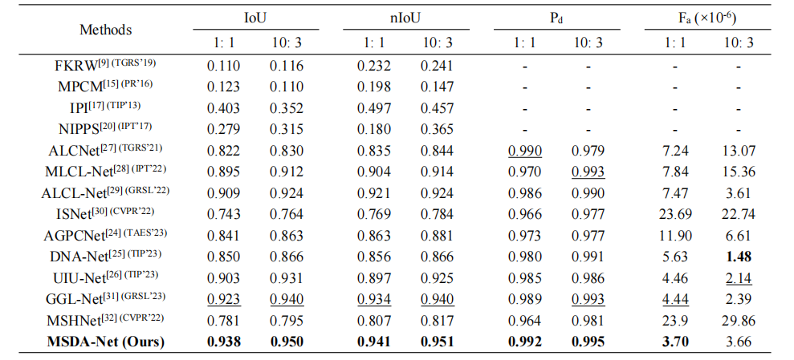

## The official complete code for paper "Multi-Scale Direction-Aware Network for Infrared Small Target Detection" [[Paper](https://arxiv.org/abs/2406.02037)] [[知乎](https://zhuanlan.zhihu.com/p/1979260996741788532)] [Accepted by TGRS2025]

1. This code integrates a series of infrared small target detection networks we built: **MLCL-Net** [[paper](https://doi.org/10.1016/j.infrared.2022.104107)],
**ALCL-Net** [[paper](https://ieeexplore.ieee.org/document/9785618)], **GGL-Net** [[paper](https://ieeexplore.ieee.org/abstract/document/10230271)]
and **MSDA-Net** [[Paper/arXiv](https://arxiv.org/abs/2406.02037)]. For details, please see the "model" folder.    

2. It is worth mentioning that **our solution based on MSDA-Net** won ***the first prize*** in **the PRCV2024 Wide-area Infrared Small Target Detection Challenge**

3. Everyone is welcome to follow our new work [[**PAL Framework**](https://github.com/YuChuang1205/PAL)] on the task of *"Infrared small target detection with single point supervision"*. On the task of *"Infrared small target detection with single point supervision"*, equipped with our proposed "PAL Framework", MSDA-Net also has SOTA performance.

4. !!! We strongly recommend using our integrated framework [[**PAL Framework**](https://github.com/YuChuang1205/PAL)], which **incorporates multiple networks**, including MSDA-Net, and allows convenient switching between **different supervision paradigms** (Full supervision and Single point supervision) as well as our integrated framework  (SIRST, NUDT-SIRST, IRSTD-1k and SIRST3). In addition, compared with this released codebase that resizes training images to a fixed resolution, the PAL framework adopts a cropping strategy with a patch size of 256×256 pixels. Extensive empirical evaluations demonstrate that **the PAL framework provides a more reasonable basic training framework and consistently achieves superior performance**.


## Overview

<p align="center">
  </br>
  <span align="center">MSDA-Net</span> 
</p>
We propose a multi-scale direction-aware network (MSDA-Net), which is the first attempt to integrate the high-frequency directional features of infrared small targets as domain prior knowledge into neural networks.
<br />
<!--
Module Details:

* **High-frequency direction injection module**:
<p align="center">
  </br>
  <span align="center">High-frequency direction injection module</span>  
</p>

* **Multi-directional feature awareness module**:
<p align="center">
  </br>
  <span align="center">Multi-directional feature awareness module</span>  
</p>

* **Multi-Scale Direction-Aware module**:
<p align="center">
  </br>
  <span align="center">Multi-Scale Direction-Aware module</span>  
</p>

* **Multi-Scale Direction-Aware module**:
<p align="center">
  </br>
  <span align="center">Feature alignment fusion module</span>  
</p>
-->

## Datasets
1. Original datasets
* **NUDT-SIRST** [[Original dataset](https://pan.baidu.com/s/1WdA_yOHDnIiyj4C9SbW_Kg?pwd=nudt)] [[paper](https://ieeexplore.ieee.org/document/9864119)]
* **SIRST** [[Original dataset](https://github.com/YimianDai/sirst)] [[paper](https://ieeexplore.ieee.org/document/9423171)]
* **IRSTD-1k** [[Original dataset](https://drive.google.com/file/d/1JoGDGF96v4CncKZprDnoIor0k1opaLZa/view)] [[paper](https://ieeexplore.ieee.org/document/9880295)]  

2. The datasets we created from original datasets (**can be used directly in our demo**)
     
* [💎 Download the dataset required by our code!!!](https://pan.baidu.com/s/1i4hMsY2ldQG3-cumrbNx-w?pwd=1234)

<!--
## Requirements

* albumentations 1.3.0
* python 3.8.19
* pytorch 2.0.0+cu118
* tqdm 0.0.2
* numpy 1.24.4
* Pillow 8.4.0
-->

## How to use our code

1. Download the dataset
   
&nbsp;&nbsp;&nbsp;&nbsp;&nbsp;&nbsp;&nbsp;&nbsp;Click [download datasets](https://pan.baidu.com/s/1i4hMsY2ldQG3-cumrbNx-w?pwd=1234) 

&nbsp;&nbsp;&nbsp;&nbsp;&nbsp;&nbsp;&nbsp;&nbsp;Unzip the downloaded compressed package to the root directory of the project.

2. Creat a Anaconda Virtual Environment

    ```
    conda create -n MSDA-Net python=3.8 
    activate MSDA-Net 
    ```
3. Configure the running environment
   
   ```
    pip install torch==1.13.1+cu116 torchvision==0.14.1+cu116 torchaudio==0.13.1 --extra-index-url https://download.pytorch.org/whl/cu116
    pip install segmentation_models_pytorch -i https://pypi.tuna.tsinghua.edu.cn/simple
    pip install PyWavelets -i https://pypi.tuna.tsinghua.edu.cn/simple
    pip install scikit-image -i https://pypi.tuna.tsinghua.edu.cn/simple
    pip install albumentations==1.3.0 -i https://pypi.tuna.tsinghua.edu.cn/simple
    pip install scikit-learn matplotlib thop h5py SimpleITK scikit-image medpy yacs torchinfo
    ```
4. Training the model  
   
    The default dataset is IRSTD-1K. If you need to train others, please modify the corresponding dataset path.<br>
    (If you want to train NUDT-SIRST, please note that the parameter IMAGE_SIZE in the training file needs to be changed to 256.)
    ```
    python train_MSDA_Net.py
    ```
5. Testing the Model  
     
    Click [download weight files in the paper](https://pan.baidu.com/s/1-kBb022H7sutvknBv9JgGw?pwd=1234) (Unzip the downloaded package to the root directory of the project)
    
    The default dataset is IRSTD-1K. If you need to test the weight file under other datasets, please modify the corresponding dataset path and weight file path.<br>
    (If you want to train NUDT-SIRST, please note that the parameter IMAGE_SIZE in the training file needs to be changed to 256.)
    ```
    python test_MSDA_Net.py
    ```
## Results and Weights File

* **Quantative Results on NUDT-SIRST**:
<p align="center">
  <span align="center">Comparison of MSDA-Net and various SOTA methods on the NUDT-SIRST dataset</span></br>  
  
</p>

* **Quantative Results on SIRST**:
<p align="center">
  <span align="center">Comparison of MSDA-Net and various SOTA methods on the SIRST dataset</span></br>  
  
</p>

* **Quantative Results on IRSTD-1k**:
<p align="center">
  <span align="center">Comparison of MSDA-Net and various SOTA methods on the IRSTD-1k dataset</span></br>  
  
</p>

* **MSDA-Net weight files for each dataset**:


     | &nbsp;&nbsp;&nbsp;&nbsp;&nbsp;&nbsp;&nbsp;&nbsp;&nbsp;  Dataset   &nbsp;&nbsp;&nbsp;&nbsp;&nbsp;&nbsp;&nbsp;&nbsp;&nbsp; | &nbsp;&nbsp; miou &nbsp;&nbsp;  |&nbsp;&nbsp; niou &nbsp;&nbsp; |&nbsp;&nbsp; P<sub>d</sub>  &nbsp;&nbsp;|&nbsp;&nbsp; Fa(×10<sup>-6</sup>) &nbsp;&nbsp; | &nbsp;&nbsp;&nbsp;&nbsp;&nbsp;&nbsp;&nbsp;&nbsp; weight &nbsp;&nbsp;&nbsp;&nbsp;&nbsp;&nbsp;&nbsp;&nbsp;|                                
     | :---------------:  |:-----:   |:-----:  |:-----:  | :-------: | :-----------: |
     |NUDT-SIRST (1 : 1) |0.938  |0.941 |0.992 | 3.70    |<a href="https://pan.baidu.com/s/1WeFDoUUCt50sskc5z3z1hg?pwd=1234">MSDA_Net_nudt_1_1.pth</a>    |
     |NUDT-SIRST (10 : 3)|0.950  |0.951 |0.995 | 3.66    |<a href="https://pan.baidu.com/s/12q7WGX5qUHQ0pWKvoAwkoA?pwd=1234">MSDA_Net_nudt_3_7.pth</a>    |              
     |SIRST (341 : 86)   |0.811  |0.794 |1.0   | 7.19    |<a href="https://pan.baidu.com/s/1Kkfm-R8elIvgWpC066MNOg?pwd=1234">MSDA_Net_SIRST_341_86.pth</a>|          
     |SIRST (224 : 96)   |0.800  |0.775 |1.0   | 5.01    |<a href="https://pan.baidu.com/s/1bbrNL2UuirkOUh9O1tYdSA?pwd=1234">MSDA_Net_SIRST_224_96.pth</a>|
     |IRSTD-1k        |0.719  |0.692 |0.943 | 11.39   |<a href="https://pan.baidu.com/s/185qKkHqO838FCZOVFXrUCQ?pwd=1234">MSDA_Net_IRSTD_1K.pth</a>    |

## Citation

If you find this repo helpful, please give us a 🤩**star**🤩. Please consider citing the **MSDA-Net** if it benefits your project. <br>  

BibTeX reference is as follows.
```
@misc{zhao2024multiscaledirectionawarenetworkinfrared,
      title={Multi-Scale Direction-Aware Network for Infrared Small Target Detection}, 
      author={Jinmiao Zhao and Zelin Shi and Chuang Yu and Yunpeng Liu},
      year={2024},
      eprint={2406.02037},
      archivePrefix={arXiv},
      primaryClass={cs.CV},
      url={https://arxiv.org/abs/2406.02037}, 
}
```

word reference is as follows.
```
Jinmiao Zhao, Zelin Shi, Chuang Yu, and Yunpeng Liu. Multi-Scale Direction-Aware Network for Infrared Small Target Detection. arXiv preprint arXiv:2406.02037, 2024.
```

## Other link 

1. My homepage: [[YuChuang](https://github.com/YuChuang1205)]
2. My "PAL Framework" project code (ICCV2025)：[[Link](https://github.com/YuChuang1205/PAL)]
3. My latest "FDEP Framework" project code: [[Link](https://github.com/YuChuang1205/FDEP-Framework)]
 
